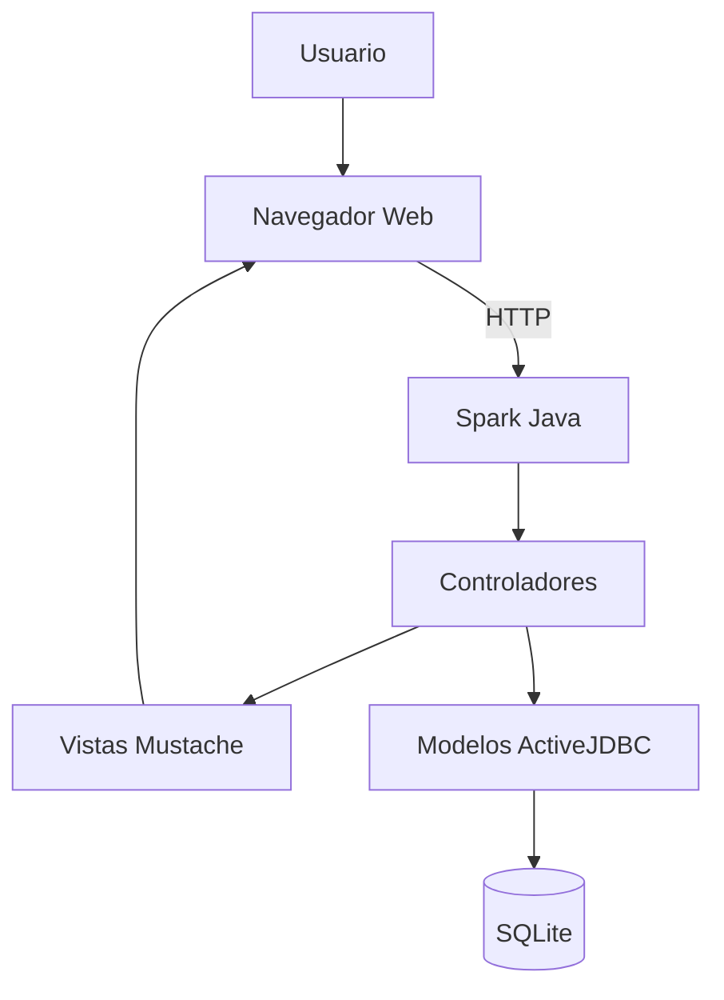
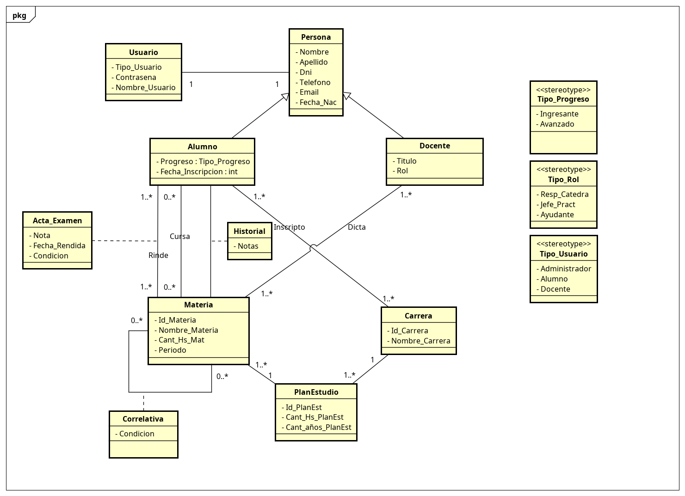

## ACTIVIDAD 3: (Design) Generar los Diagramas de Arquitectura del Sistema y Diagrama de Diseño

### Diagrama de Arquitectura

El sistema fue desarrollado siguiendo una arquitectura basada en el patrón Modelo–Vista–Controlador (MVC), separando la interfaz de usuario, la lógica de negocio y el acceso a los datos.



### Descripción de los Componentes

#### Usuario:
Interactúa con el sistema a través de un navegador web realizando consultas, registros e inscripciones.

#### Navegador Web:
Permite visualizar las páginas generadas por el sistema y enviar solicitudes HTTP al servidor.

#### Spark Java:
Framework web utilizado para gestionar las rutas, recibir solicitudes y coordinar el flujo de información entre los distintos componentes.

#### Controladores:
Contienen la lógica de las rutas del sistema. Procesan las solicitudes de los usuarios, validan datos y coordinan las operaciones necesarias.

#### Modelos (ActiveJDBC):
Representan las entidades del dominio (Alumno, Docente, Carrera, Materia, Usuario, etc.) y permiten interactuar con la base de datos mediante objetos Java.

#### Vistas (Mustache):
Generan dinámicamente las páginas HTML mostradas al usuario a partir de la información proporcionada por los controladores.

#### Base de Datos SQLite:
Almacena toda la información persistente del sistema, incluyendo usuarios, carreras, materias, inscripciones y demás datos académicos.

---

### Diagrama de Diseño (Modelo de Dominio)

El siguiente diagrama representa las principales entidades del sistema, sus atributos y las relaciones existentes entre ellas. Además, refleja las reglas de negocio implementadas y la estructura conceptual utilizada durante el desarrollo del proyecto.

#### Diagrama inicial (Ingeniería de Software I)

Este fue el modelo de dominio elaborado durante la primera etapa del proyecto. Representa una versión preliminar del sistema y no contempla todas las funcionalidades, relaciones y requisitos que fueron incorporados posteriormente durante el desarrollo de Ingeniería de Software II.



#### Diagrama actualizado (Ingeniería de Software II)

Este diagrama corresponde a la versión final del modelo de dominio. Fue refinado para representar adecuadamente la arquitectura actual del sistema, incorporando nuevas entidades, clases de asociación, cardinalidades, restricciones y relaciones necesarias para soportar funcionalidades como la gestión de carreras, planes de estudio, inscripciones, asignación de docentes, carga de notas y administración académica.


---

### Responsabilidades e Interacciones

#### Gestión de Usuarios:
Los usuarios se autentican mediante credenciales. El sistema valida el acceso y habilita las funcionalidades correspondientes según el rol asignado (Administrador, Docente o Alumno).

#### Gestión Académica:
Los administradores pueden crear carreras, asociarlas a facultades y definir las materias correspondientes a cada año del plan de estudios.

#### Gestión de Docentes:
Los administradores asignan docentes a materias específicas y determinan su función dentro de la cátedra.

#### Gestión de Alumnos:
Los alumnos pueden completar sus datos personales, inscribirse a carreras y consultar la información académica disponible.

#### Gestión de Inscripciones y Notas:
Los docentes registran calificaciones y los alumnos pueden consultar su rendimiento académico. La información queda almacenada en la base de datos para su seguimiento posterior.

#### Persistencia de Datos:
Todas las operaciones realizadas por los usuarios son procesadas por los controladores y almacenadas mediante ActiveJDBC en la base de datos SQLite.
```