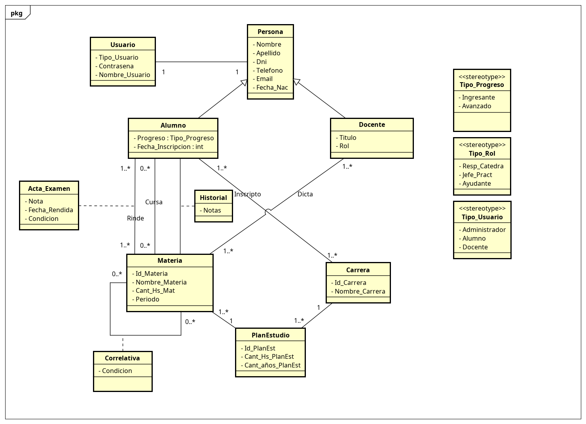

# Trabajo Práctico Integrador - Ingeniería de Software II

## Integrantes
- Medina Sebastian
- Olivero Leandro

# Sistema de Gestión Estudiantil

## ACTIVIDAD 1: (Requirements) Describir su proyecto.

### 1. Problema a resolver
El problema a resolver consiste en realizar un sistema que reemplace la gestion del registro de alumnos
que habia quedado obsoleto por utilizar un sistema de planilla antiguo manuscrito.
Esto dificulta la centralización de la información y genera complicaciones en la
comunicación entre alumnos, docentes y administrativos
* Registrar y consultar datos de estudiantes, docentes y materias.
* Gestionar planes de estudio, materias por carrera y sus correlatividades.
* Validar que un alumno curse según correlativas aprobadas.
* Registrar el avance académico y las notas finales de los alumnos.
* Asignar docentes a materias con distintos roles (responsable, JTP, ayudante).
* Tener funcionalidades de seguimiento del progreso y riesgo de abandono de los estudiantes.

### Diagrama de clases UML:


### 2. Usuarios del sistema

* Administrador.
* Alumno.
* Docente.

### 3. Funcionalidades principales

* Gestionar alumno.
* Visualizar datos del alumno.
* Gestionar docente.
* Visualizar datos del docente.
* Visualizar la materia que dicta el docente.
* Visualizar alumnos que tiene el docente.
* Materia inscripta del docente.
* Gestionar materia.
* Gestionar plan de estudio.
* Visualizar alumnos que cursan esa materia.
* Gestionar carrera.
* Correlativas entre materias. (Muestra correlativas dependiendo el plan de estudio).
* Gestion de Notas. (Agregar nota final a un alumno en una materia)
* Condición del alumno en una materia con su nota.
* Gestión de usuarios (Identificación como: alumno, docente o administrativo).
* Consulta de historial académico del alumno (notas de materias, materias que cursa actualmente y las que le faltan).
* Seguimiento de estudiantes. 
* Autenticación de usuarios.
* Gestión de roles.

### 4. Restricciones técnicas

* Aplicación desarrollada en Java
* Uso de Spark como framework web
* Base de datos SQLite
* Arquitectura monolítica

### 5. Tamaño del equipo

El equipo está compuesto por 2 integrantes.

### 6. Tecnologías elegidas y justificación

* Java: lenguaje principal por su robustez
* Spark: framework liviano para desarrollo web
* SQLite: base de datos simple y fácil de integrar
* Mustache: motor de plantillas sencillo
* Maven: gestión de dependencias 

## Decisiones de diseño

- Se decidió utilizar SQLite por su simplicidad y facilidad de integración.
- Se optó por ActiveJDBC para simplificar el acceso a la base de datos.
- Se implementó una arquitectura MVC para separar responsabilidades.
- Se decidió no implementar correlativas en esta etapa por complejidad.

### 7. Plazo estimado

El desarrollo del proyecto se realizó en etapas, correspondientes a los trabajos prácticos de la materia, con una duración estimada de 12 semanas.

### 8. Cambios de alcance

* No se implementaron todas las funcionalidades definidas inicialmente.
* En la primera parte se priorizó la gestión de docentes, alumnos y materias.
* Algunas funcionalidades quedaron como futuras mejoras.

### 9. Problemas encontrados

* Problemas con la estructura de la base de datos
* Errores de conexión y columnas inexistentes
* Validaciones de datos en formularios
* Manejo de errores del servidor

### 10. Organización del equipo

El trabajo se realizó de forma colaborativa, utilizando control de versiones con GitHub y dividiendo tareas entre los integrantes.

## ACTIVIDAD 2: (Auditoría) Análisis de riesgos con IA.
### a) Riesgos identificados por IA

| Tipo de Riesgo | Descripción | Probabilidad | Impacto | 
|----------------|-------------|--------------|---------|
| Técnico        |Problemas con el disenio de la base de datos (relaciones complejas como correlativas) | Alta | Critico |
| Técnico        |Errores en validaciones de logica (ej.: correlativas mal implementadas) | Media | Alto | 
| Técnico        |Integracion incorrecta entre backend (Spark), y bases de datos SQLite | Media | Alto |
| Técnico        |Escalabilidad limitada por uso de SQLite | Baja | Medio | 
| Organizacional |Falta de comunicacion entre integrantes del equipo |Media |Alto |
| Organizacional |Distribucion desiguales de tareas |Media |Medio |
| Planificación  |Subestimacion del tiempo de desarrollo |Alta |Critico |
| Planificación  |Cambios en los requerimientos durante el desarrollo |Alta |Critico |
| Planificación  |Falta de definicion clara de prioridades del backlog |Media |Medio |
| Humano         |Falta de experiencia en tecnologias |Media |Alto |
| Humano         |Desmotivacion o baja participacion de algun integrante |Baja |Medio | 
| Humano         |Errores humanos en carga de datos |Alta |Medio |

---

### b) Riesgos identificados por el equipo

| Tipo de Riesgo | Descripción | Probabilidad | Impacto |
|----------------|-------------|--------------|---------|
| Técnico |Errores en la conexion a la base de datos |Alta |Alto | 
| Técnico |Problemas con el scheme.sql desactualizado |Alta |Alto |
| Técnico |Fallos en validacion de formularios |Media |Medio |
| Técnico |Falta de tests automatizados que validen el correcto funcionamiento del sistema |Alta |Alto |
| Organizacional |Falta de comunicacion en el equipo |Baja |Medio |
| Organizacional |Falta de reuniones periódicas que puede generar descoordinación entre los integrantes |Media |Medio |
| Organizacional |Falta de coordinacion de GitHub |Media |Medio | 
| Planificación |Entrega fuera de plazo |Baja |Alto | 
| Humano |Programadores sin experiencia para resolver algo |Alta |Critico | 
| Humano |Roles no definidos por pocos integranes |Alta |Bajo | 
| Humano |Dificultad para detectar errores mediante pruebas manuales únicamente |Alta |Alto | 


---

### c) Comparación de análisis

#### Riesgos identificados por la IA y no por el equipo
- Escalabilidad de SQLite
- Desmotivación del equipo
- Cambios de requerimientos
- Problemas en backlog/priorización
- Complejidad de correlatividades 
 

#### Riesgos identificados por el equipo y no por la IA
- Problemas concretos con schema.sql
- Errores en conexión DB 
- Problemas prácticos con GitHub

#### Calidad del análisis

El LLM identifica riesgos mas generales basados en los datos con los que cuenta. 
Nuestro equipo se baso en problemas reales encontrados durante el desarrollo del sistema.
La combinación de ambos enfoques permite obtener un análisis más completo.
La IA aporta amplitud y visión profesional, mientras que el equipo aporta profundidad en la implementación real.

---

## ACTIVIDAD 3: (Design) Generar los Diagramas de Arquitectura del sistema y diagrama de diseño.


### Diagrama de Arquitectura

El siguiente diagrama representa la arquitectura general del sistema, mostrando los componentes principales y sus interacciones.

```mermaid
graph TD

A[Cliente Web (Navegador)] -->|HTTP Request| B[Aplicación Web Java]

B -->|Consultas| C[(Base de Datos SQLite)]

B --> D[Controladores]
B --> E[Modelos (ActiveJDBC)]
B --> F[Vistas (Mustache)]

D --> E
E --> C
D --> F