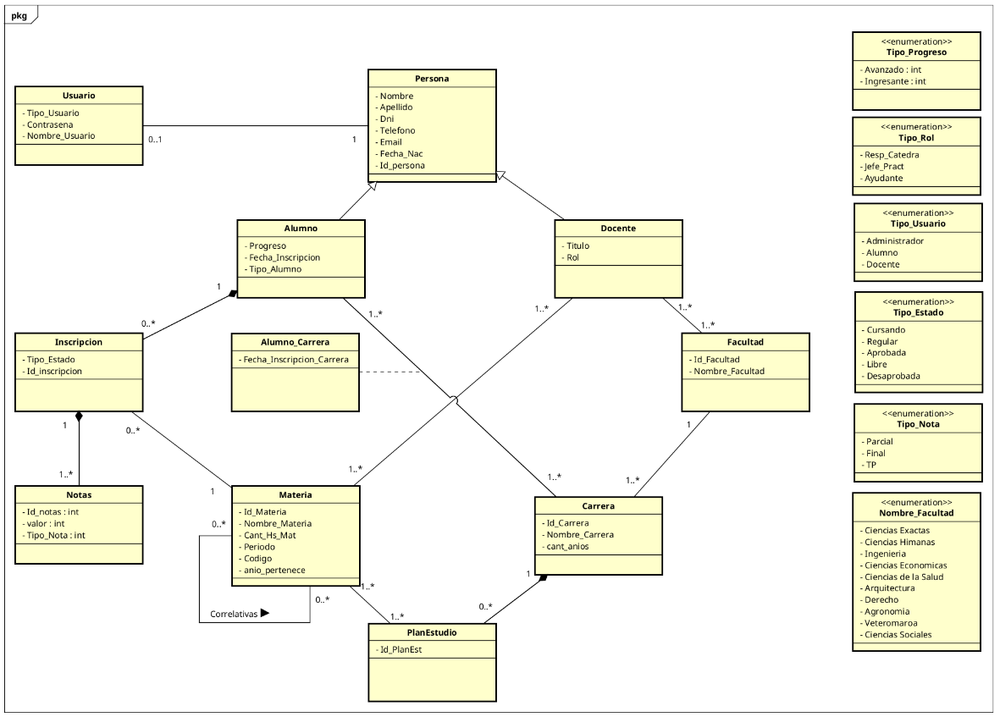

# Trabajo Práctico Integrador - Ingeniería de Software II

## Integrantes
- Medina Sebastian
- Olivero Leandro

# Sistema de Gestión Académica Universitaria
## ACTIVIDAD 1: (Requirements) Describir su proyecto.

### 1. Problema a resolver
### 1. Problema a resolver

El problema a resolver consiste en desarrollar un sistema académico que permita reemplazar y modernizar los procesos de gestión estudiantil realizados mediante registros manuales y planillas tradicionales.

La utilización de registros manuscritos y sistemas poco integrados dificulta la centralización de la información académica, genera demoras administrativas y complica la comunicación entre alumnos, docentes y personal administrativo.

El sistema propuesto permitirá:

* Registrar y consultar datos de estudiantes, docentes y materias.
* Gestionar planes de estudio, materias por carrera y sus correlatividades.
* Validar que un alumno curse según las correlatividades aprobadas.
* Registrar el avance académico y las notas finales de los alumnos.
* Asignar docentes a materias con distintos roles (Responsable, JTP y Ayudante).
* Realizar seguimiento del progreso académico y detectar posibles situaciones de riesgo de abandono estudiantil.

---

### Diagrama de clases UML:

---

### 2. Usuarios y Actores del Sistema

El sistema académico está diseñado para ser utilizado por distintos tipos de usuarios, cada uno con funciones y responsabilidades específicas dentro de la gestión universitaria.

#### Usuarios Principales

##### Estudiantes
Son los usuarios encargados de gestionar su actividad académica. Entre sus principales acciones se encuentran:

- Completar y actualizar sus datos personales.
- Inscribirse a una carrera.
- Consultar las materias correspondientes a su plan de estudios.
- Realizar inscripciones a materias.
- Visualizar calificaciones y avance académico.

##### Docentes
Participan en la gestión de las actividades académicas relacionadas con las asignaturas que tienen asignadas.

Sus funciones principales incluyen:

- Consultar las materias bajo su responsabilidad.
- Gestionar información académica de los estudiantes.
- Registrar y actualizar calificaciones.
- Realizar el seguimiento del desempeño de los alumnos.

##### Administradores
Son responsables de la configuración y mantenimiento general del sistema.

Entre sus tareas se encuentran:

- Crear y administrar usuarios.
- Gestionar carreras y planes de estudio.
- Registrar materias y su organización académica.
- Asignar docentes a las diferentes asignaturas.
- Mantener la estructura institucional del sistema.

---

#### Entidades Principales del Dominio

##### Persona
Representa la información básica común a todos los individuos registrados en el sistema, como nombre, apellido, DNI, correo electrónico y demás datos personales.

##### Usuario
Gestiona las credenciales de acceso y el rol asociado dentro de la aplicación (Administrador, Docente o Alumno).

##### Carrera
Define una propuesta académica determinada, incluyendo su duración, facultad responsable y conjunto de materias asociadas.

##### Materia
Representa cada asignatura perteneciente a una carrera. Contiene información como código identificador, carga horaria, año de cursado y período académico correspondiente.

##### Plan de Estudio
Establece la relación entre carreras y materias, organizando la estructura curricular que deberá seguir el estudiante durante su formación.

##### Inscripción
Registra la participación de un alumno en una determinada materia y permite realizar el seguimiento de su estado académico.

##### Nota
Almacena las calificaciones obtenidas por los estudiantes durante el cursado, incluyendo evaluaciones parciales y finales.

##### Facultad
Representa las distintas unidades académicas de la institución, responsables de administrar las carreras y actividades educativas asociadas.

---

#### Sistema de Autenticación

El sistema incorpora un módulo de autenticación encargado de controlar el acceso a la aplicación mediante credenciales de usuario.

Sus responsabilidades principales son:

- Verificar la identidad de los usuarios.
- Gestionar sesiones activas.
- Controlar permisos según el rol asignado.
- Garantizar la seguridad de la información almacenada.

---

### 3. Funcionalidades principales

El sistema brinda herramientas para la administración académica y la gestión de usuarios dentro de la institución, contemplando las siguientes funcionalidades:

#### Gestión de Usuarios y Roles

- Registro de nuevos usuarios dentro del sistema.
- Autenticación mediante usuario y contraseña.
- Administración de perfiles según el rol asignado (Alumno, Docente o Administrador).
- Consulta y actualización de datos personales.
- Control de acceso a funcionalidades según permisos definidos para cada rol.

#### Gestión Académica

- Creación y administración de carreras.
- Asociación de carreras a una facultad determinada.
- Definición de la cantidad de años que componen cada carrera.
- Registro de carreras indicando facultad, duración y materias correspondientes a cada año académico.
- Creación y gestión de materias.
- Asignación de materias a los distintos años de la carrera.
- Definición de características de cada materia, incluyendo código identificador, carga horaria y período de cursado.
- Administración de planes de estudio.
- Configuración de correlatividades entre materias según cada plan académico (funcionalidad prevista para futuras versiones).

#### Gestión de Docentes

- Registro y actualización de información docente.
- Asociación de docentes a facultades.
- Asignación de docentes responsables de materias.
- Gestión de roles docentes (Responsable, JTP o Ayudante).
- Consulta de materias asignadas a cada docente.
- Visualización de alumnos inscriptos en las materias que dicta.

#### Gestión de Alumnos

- Registro y actualización de información estudiantil.
- Inscripción de alumnos a carreras.
- Inscripción a materias habilitadas según su situación académica.
- Seguimiento del progreso académico del estudiante.
- Consulta del historial académico completo.

#### Gestión de Inscripciones y Rendimiento Académico

- Inscripción de alumnos a materias.
- Registro de estados de cursado (Cursando, Aprobada o Desaprobada).
- Carga y administración de calificaciones parciales y finales.
- Consulta de notas obtenidas en cada materia.
- Determinación de la condición académica del alumno en función de sus resultados.
- Visualización de materias aprobadas, en curso y pendientes.

#### Consultas y Seguimiento

- Consulta de carreras disponibles.
- Consulta de planes de estudio asociados a cada carrera.
- Visualización de correlatividades requeridas para cursar determinadas materias.
- Seguimiento del avance académico de los estudiantes.
- Generación de información sobre el estado académico de alumnos, docentes y carreras.

---

### 4. Requerimientos No Funcionales

Además de las funcionalidades académicas y administrativas, el sistema debe cumplir una serie de requisitos de calidad que aseguren su correcto funcionamiento y faciliten su utilización por parte de los distintos usuarios.

#### Usabilidad
La aplicación debe ofrecer una interfaz sencilla, clara e intuitiva, permitiendo que alumnos, docentes y administradores puedan utilizar sus funciones sin necesidad de capacitación previa extensa. La navegación debe ser consistente y facilitar el acceso a las distintas opciones del sistema.

#### Confiabilidad
El sistema debe garantizar la integridad y consistencia de la información académica almacenada, evitando pérdidas de datos y reduciendo la posibilidad de errores durante las operaciones de registro, consulta o modificación.

#### Rendimiento
Las consultas relacionadas con alumnos, docentes, carreras, materias e historiales académicos deben responder en tiempos adecuados, incluso cuando exista una gran cantidad de registros almacenados.

#### Seguridad
El acceso a la información debe estar protegido mediante autenticación de usuarios y control de permisos según el rol asignado (administrador, docente o alumno). Cada usuario podrá acceder únicamente a las funcionalidades correspondientes a su perfil.

#### Mantenibilidad
La estructura del sistema debe permitir realizar correcciones, mejoras y ampliaciones de manera sencilla, favoreciendo la reutilización del código y la incorporación de nuevas funcionalidades en futuras versiones.

#### Escalabilidad
La arquitectura debe permitir el crecimiento gradual del sistema, contemplando la incorporación de nuevas carreras, materias, usuarios y procesos académicos sin requerir modificaciones significativas en su funcionamiento principal.

#### Disponibilidad
La aplicación debe encontrarse operativa durante los períodos habituales de uso institucional, permitiendo realizar consultas, inscripciones y gestiones académicas de manera continua.

---

El desarrollo del sistema se encuentra condicionado por las siguientes decisiones tecnológicas y de arquitectura:

- Lenguaje de programación: **Java**.
- Framework web: **Spark Java**.
- Motor de base de datos: **SQLite**.
- Persistencia de datos mediante **ActiveJDBC**.
- Motor de plantillas para la interfaz web: **Mustache**.
- Gestión de dependencias mediante **Maven**.
- Arquitectura de software de tipo **monolítica**, integrando la lógica de negocio, persistencia y presentación dentro de una misma aplicación.
- Ejecución en entorno local utilizando servidor embebido proporcionado por Spark.

---

### 5. Equipo de Trabajo

El desarrollo del sistema será realizado por un equipo de **2 integrantes**, trabajando de manera colaborativa en las distintas etapas del proyecto.

#### Integrantes y responsabilidades

**Leandro Olivero**
- Desarrollo de funcionalidades del sistema.
- Diseño e implementación de la base de datos.
- Programación de la lógica de negocio.
- Integración entre frontend y backend.
- Elaboración de documentación técnica.

**Sebastian Medina**
- Desarrollo de funcionalidades del sistema.
- Análisis y definición de requerimientos.
- Diseño de interfaces y experiencia de usuario.
- Realización de pruebas y validaciones.
- Elaboración de documentación y diagramas del proyecto.

#### Organización del trabajo

Debido al tamaño reducido del equipo, ambos integrantes participan activamente en todas las fases del desarrollo, incluyendo:

- Análisis y relevamiento de requerimientos.
- Diseño de la arquitectura y del modelo de datos.
- Implementación de funcionalidades.
- Pruebas y corrección de errores.
- Elaboración de documentación técnica y académica.
- Presentación y seguimiento del proyecto.

La distribución de tareas es flexible y se adapta a las necesidades de cada iteración, promoviendo la colaboración constante y la revisión conjunta de los avances realizados.

---

### 6. Tecnologías Utilizadas y Decisiones de Diseño

Para el desarrollo del sistema se seleccionó un conjunto de tecnologías que permiten construir una aplicación web sencilla, mantenible y adecuada para los requerimientos académicos planteados.

#### Tecnologías utilizadas

- **Java**: lenguaje principal utilizado para implementar la lógica de negocio y las funcionalidades del sistema, debido a su estabilidad, amplio soporte y orientación a objetos.
- **Spark Java**: framework web liviano empleado para la creación de rutas HTTP, manejo de solicitudes y construcción de la aplicación web.
- **SQLite**: sistema gestor de base de datos relacional utilizado para almacenar la información de usuarios, carreras, materias, inscripciones y demás entidades del sistema.
- **ActiveJDBC**: herramienta de persistencia utilizada para simplificar el acceso a los datos mediante modelos orientados a objetos.
- **Mustache**: motor de plantillas empleado para generar las vistas dinámicas mostradas al usuario.
- **HTML5 y Tailwind CSS**: tecnologías utilizadas para el desarrollo de las interfaces gráficas y la adaptación visual de los distintos formularios y pantallas.
- **Maven**: herramienta utilizada para la administración de dependencias, compilación y ejecución del proyecto.
- **Git y GitHub**: utilizados para el control de versiones y el trabajo colaborativo entre los integrantes del equipo.

#### Decisiones de diseño adoptadas

Durante el desarrollo se tomaron diversas decisiones arquitectónicas y técnicas con el objetivo de mantener una estructura organizada y facilitar futuras ampliaciones:

- Se adoptó una arquitectura basada en el patrón **Modelo-Vista-Controlador (MVC)** para separar la lógica de negocio, la persistencia de datos y la presentación.
- Se eligió **SQLite** por su facilidad de configuración, portabilidad y simplicidad para proyectos académicos.
- Se incorporó **ActiveJDBC** para reducir la complejidad de las consultas SQL y simplificar la interacción con la base de datos.
- Se implementó un sistema de autenticación basado en usuarios con diferentes roles (Administrador, Docente y Alumno).
- Se utilizó **BCrypt** para el almacenamiento seguro de contraseñas mediante hash.
- Se priorizó una interfaz simple e intuitiva, permitiendo que las operaciones principales puedan realizarse mediante formularios web accesibles para cualquier usuario.
- Algunas funcionalidades avanzadas, como la gestión completa de correlatividades y validaciones académicas complejas, fueron consideradas como posibles extensiones futuras debido a las limitaciones de tiempo del proyecto.

---

### 7. Plazo estimado de Desarrollo

El proyecto fue desarrollado a lo largo del cuatrimestre correspondiente a la asignatura Ingeniería de Software I y también dentro del cuatrimestre de la asignatura Ingeniería de Software II.

La planificación general contempló aproximadamente **12 semanas de trabajo**, distribuidas entre análisis de requerimientos, diseño, implementación, pruebas y documentación.

El avance se realizó de manera incremental, incorporando funcionalidades progresivamente en cada etapa de desarrollo, permitiendo validar el funcionamiento del sistema y corregir errores detectados durante las pruebas.

---

### 8. Cambios de alcance

Durante el desarrollo surgieron algunos ajustes respecto a la planificación inicial del proyecto.

Entre los principales cambios realizados se destacan:

- Priorización de las funcionalidades esenciales relacionadas con la gestión de usuarios, carreras, materias e inscripciones.
- Implementación gradual de los distintos perfiles de usuario (Administrador, Docente y Alumno).
- Postergación de funcionalidades avanzadas como la gestión automática de correlatividades y validaciones académicas complejas para futuras versiones del sistema.
- Simplificación de ciertos procesos académicos para adecuarlos al tiempo disponible de desarrollo.

Estos cambios permitieron mantener un producto funcional y coherente con los objetivos principales definidos para la materia.

---

### 9. Problemas encontrados

A lo largo del proyecto se presentaron distintos inconvenientes técnicos y de diseño que requirieron análisis y corrección.

Entre los más relevantes se encuentran:

- Errores relacionados con la estructura inicial de la base de datos y la definición de relaciones entre tablas.
- Problemas de sincronización entre los modelos de ActiveJDBC y las columnas existentes en SQLite.
- Manejo de sesiones y autenticación de usuarios durante el proceso de inicio y cierre de sesión.
- Problemas relacionados con los permisos de acceso según el tipo de usuario.
- Validaciones de formularios para evitar registros incompletos o inconsistentes.
- Errores derivados de nombres incorrectos de columnas o consultas SQL incompatibles con la estructura real de la base de datos.
- Integración entre las vistas Mustache y las rutas definidas en Spark.
- Organización de funcionalidades según los distintos tipos de usuario y sus permisos correspondientes.
- Errores de validación y persistencia de datos en formularios dinámicos para la carga de carreras y materias.

La resolución de estos problemas permitió mejorar la estabilidad general del sistema y fortalecer el diseño de la aplicación.

---

### 10. Organización del equipo

El proyecto fue desarrollado por un equipo de **dos integrantes**, distribuyendo las tareas de manera colaborativa según las necesidades de cada etapa.

La organización general contempló:

- Análisis y definición conjunta de los requerimientos funcionales y técnicos.
- Diseño compartido de la base de datos y de la arquitectura general del sistema.
- Desarrollo colaborativo de las funcionalidades backend y frontend.
- Realización de pruebas funcionales para verificar el correcto comportamiento de cada módulo implementado.
- Elaboración conjunta de la documentación técnica y académica requerida para el proyecto.

Para la coordinación y seguimiento del trabajo se utilizó un repositorio compartido en **GitHub**, permitiendo mantener el control de versiones y la integración continua de los cambios realizados por ambos integrantes.